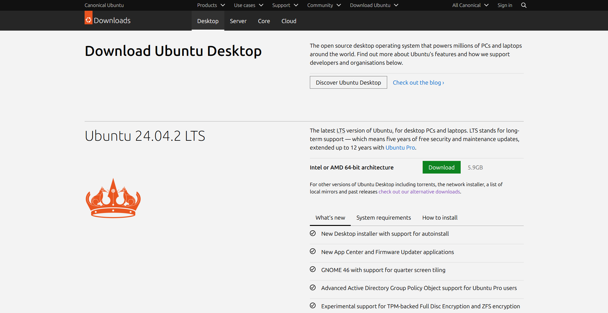

미러 서버는 다양한 용도로 사용되고 있어요. 회사 내에서만 사용하기 위한 `비공개 미러`와 커뮤니티에 공유하여 많은 사람들이 사용할 수 있도록 하는 `공개 미러`가 있어요. 이 문서에서는 두 상황 모두에서 사용이 가능한 방법으로 미러를 구축해볼 거에요.

## 미러 서버가 뭐죠?

미러 서버는 쉽게 이야기 하자면 원본 서버를 복제한 서버라고 할 수 있어요. 예를 들어서 우리가 Ubuntu iso 파일을 다운 받기 위해서 [우분투 공식 다운로드 사이트](https://ubuntu.com/download/desktop)에 방문해본다고 해볼께요.

그럼 이렇게 사이트가 뜰거에요. 



여기서 우리가 다운로드 버튼을 클릭하게 되면 우분투 사이트에서는 사용자의 접속 국가를 기반으로 우분투 공식 미러로 등록된 사이트 중 한국 서버 아무곳으로 보내서 다운로드 하도록 만들어요.

### 그럼 왜 이렇게 다운로드 하는 거죠?

그 질문에 대한 답을 드릴께요.

혹시 해외에서 파일을 받아보신적이 있나요? 예를 들자면 우리랑 정말 멀리 떨어져 있는 브라질이나 독일에서 파일을 받는다고 하면 정말 다운로드 속도가 느린 걸 알 수 있어요. 이건 우리가 여러 나라의 인터넷을 거치고 거쳐서 목적지 서버에 도달하기 때문에 많이 느린 것이라고 할 수 있어요. 

상황에 따라 다르지만 다운로드 속도가 매우 느려서 1기가 파일 하나를 받는데에 1시간이 걸릴 수도 있어요. 때문에 이런 문제를 해결하기 위해 국내에 서버를 두고 그 서버가 원본 서버에 있는 모든 파일을 다 받아놓고 뿌리는 거에요. 

이렇게 하면 사람들은 우리나라의 훌륭한 인터넷 인프라를 통해서 빠른 속도로 파일을 받아갈 수 있기 때문에 1기가 파일을 받겠다고 1시간을 버릴 필요가 없어져요. 

그렇기 때문에 우분투에서는 커뮤니티 미러를 허용해서 자신들의 기준에 맞으면 공식 미러로 인정해주고 사람들의 다운로드 요청을 해당 미러들로 보내서 빨리 받아갈 수 있도록 해주는 거에요. 게다가 우분투는 인기 있는 리눅스 운영체제이기 때문에 만약 우분투 공식 미러 하나만 두었다면 전세계 사람들이 하나의 서버로 몰려들어서 폭주할게 될테고 다운로드 속도는 (극단적으로) 100kb가 나올 수도 있어요. 사진처럼 파일의 용량이 5.9GB라면 우리는 그 파일을 받기 위해 약 16시간 20분 동안 계속 창을 켜놓고 기다려야 해요. 하루종일 다운로드만 하게 되는거죠.

### 미러를 구축하는 방법은요?

이제 미러를 구축하는 방법을 설명할께요. 

{}
먼저 이 문서에서 기준으로 하는 운영체제는 Ubuntu 22.04.5 LTS를 기준으로 해요. 그 외에 Debian이나 Xubuntu 등 같은 계열이라면 명령어는 크게 다르지 않을 거에요.
{}

미러 서비스를 하려면 다음과 같은 기본 조건을 충족해야 해요. 물론 혼자만 쓴다면 지킬 필요는 없어요. 
- 저장공간
    - 우분투는 약 5TB의 여유 공간이 있으면 좋아요.
        - 우분투 Ports까지 한다면 12TB 디스크 하나를 준비하는 게 좋아요. 
    - Proxmox는 약 700GB 정도 공간을 요구해요.
    - Kali Linux는 약 600GB 정도 공간을 요구해요.
    - Rocky Linux는 약 1.2TB 정도 공간을 요구해요.

- 서버 사양
    - 4코어 이상의 CPU를 준비하는 게 좋아요.
    - RAM은 8GB 이상이 좋아요.
    - GPU는 필요 없어요.
    - HDD/SSD 모두 사용 가능해요.
        - 그러나 HDD의 경우 일반 데스크탑용 HDD가 아닌 NAS용 또는 엔터프라이즈용 HDD를 사용해야 해요. 일반 HDD는 고부하 환경에 적합하지 않기 때문이에요.

- 네트워크
    - 최소 : 120Mbps 이상의 인터넷을 사용해야 해요.
    - 권장 : 500Mbps 이상의 인터넷을 사용해야 해요.
    - ISP : KT,SKB,LGU+ 모두 가능해요.
        - SKB가 QoS가 없기 때문에 가장 좋아요. (하지만 KT, LGU+는 QoS를 시행하고 있어요)
        - 인터넷은 반드시 대칭형 인터넷을 사용해야 해요. 비대칭형 인터넷은 품질이 매우 나쁘기 때문에 접속하는 사용자들이 큰 불편을 겪어요.


이제 미러 운영에 필요한 패키지들을 설치해야 해요. 아래 단계들을 순서대로 진행해주세요.

{}
잠깐만요! 이 가이드에서는 root 권한을 많이 사용하기 때문에 미리 계정을 root로 전환해주세요. `sudo -i`로 전환할 수 있어요.
{}

#### 패키지 업데이트

아래 명령어를 실행하면 패키지 업데이트를 살펴보고 업데이트를 진행하게 돼요. 
``` bash
apt update; apt upgrade -y
```

#### 필수 패키지 설치하기

업데이트가 끝났다면 각종 필수 패키지를 설치해주세요.

``` bash
apt install -y rsync wget curl nginx
```

문제 없이 설치가 끝났나요? 그럼 이제 원본 서버로부터 복제한 데이터를 저장할 폴더를 생성해야 해요. 

{}
여기서 주의해야 하는 것은 만약 부팅용으로는 SSD 128GB를 미러 디스크는 24TB라면 미러로 사용할 폴더를 생성한 뒤에 반드시 미러로 사용할 디스크를 해당 폴더에 마운트 해야 해요. 
{}

아래 명령어를 실행해서 복제한 데이터를 저장할 폴더를 생성해주세요.

``` bash
cd /
mkdir -p /mirror
chmod 755 /mirror
```

### 데이터를 복제할 도구 준비하기

우리는 앞서 필수 패키지를 설치할 때 rsync를 설치했어요. 여기서부터는 여러분이 원하는대로 선택해서 진행해주세요. 

#### 📜 Rsync 스크립트를 통해서 진행하기

Rsync는 많은 미러들이 선택한 데이터 복제 방식이에요. 우리는 ROKFOSS 프로젝트에서 배포하는 Rsync 스크립트를 활용해볼거에요. 

##### 스크립트 다운로드하기

스크립트는 앞서 생성했던 /mirror 폴더에 파일들을 동기화 하도록 해줄거에요. 때문에 스크립트를 /mirror 폴더에 저장해선 안돼요. 그럼 동기화 하면서 스크립트가 삭제되버릴 수 있어요. 

그래서 우리는 스크립트를 /root 폴더에 저장해서 실행해볼께요.

{}
원한다면 root 사용자가 아닌 일반 사용자로도 진행할 수 있어요. 그런 경우에는 디렉터리 경로에 주의하면서 진행해주세요. 여기서는 root를 기준으로 하고 있어요.
{}

``` bash
cd ~; mkdir rsync
wget https://download.krfoss.org/dsync-m.sh 
chmod +x /root/rsync/dsync-m.sh
```

다운로드가 완료되었나요? 이제 스크립트를 수정해야 해요. 아래 명령어를 실행해서 스크립트를 열어주세요.

``` bash
vi /root/rsync/dsync-m.sh 
```

스크립트 내에서 다음 부분을 미러링하려는 배포판에 맞게 수정해주세요. 아래 예시에서는 proxmox를 복제한다고 가정하고 있어요. 만약 다른 걸 하려고 한다면 그에 맞게 수정해주세요!

아래 표에 주요 배포판의 Rsync 주소를 적어놓았어요. 가끔 특정 미러가 동작하지 않을 수도 있어요. 그럴 땐 다른 미러를 선택해주세요. 
{}
dsync.krfoss.org는 허용된 아이피만 Rsync 서비스를 이용할 수 있어요. 이용하고자 한다면 반드시 ROKFOSS 공식 메일(<a href=mailto:krfoss@krfoss.org>krfoss@krfoss.org</a>)에 연락해주세요!
{}

| 배포판        | rsync 소스 URL                                                                 | 예상 용량      |
|--------------|-------------------------------------------------------------------------------|--------------|
| Debian      | rsync://mirror.keiminem.com/debian/ <br> rsync://mirror.keiminem.com/debian-ports/ <br> rsync://mirror.keiminem.com/debian-security/ <br> rsync://mirror.keiminem.com/debian-cd/ <br> rsync://mirror.keiminem.com/debian-multimedia/ <br> rsync://mirror.keiminem.com/debian-archive/ | 약 10TB       |
| Ubuntu      | rsync://mirror.techlabs.co.kr/ubuntu/ <br> rsync://mirror.techlabs.co.kr/ubuntu-ports/  | 약 10TB       |
| Proxmox     | rsync://dsync.krfoss.org/proxmox/                                                       | 약 600GB     |
| Kali Linux  | rsync://mirror.techlabs.co.kr/kali/ <br> rsync://mirror.techlabs.co.kr/kali-images/     | 합계 약 600GB|
| Arch Linux  | rsync://mirror.funami.tech/arch/                                                        | 약 110GB     |
| Rocky Linux | rsync://rsync.mirror.zzunipark.com/rocky/ <br> rsync://rsync.mirror.zzunipark.com/rocky-sigs/       | 합계 약 1.3TB|
| OPNsense    | rsync://dsync.krfoss.org/opnsense/                                                      | 약 200GB     |
| fedora      | rsync://mirror.hemino.net/fedora/                                                       | 약 6TB       |

``` bash
# 1. 록파일 경로 수정
lockfile="/root/mirror/배포판이름.lock"  # 예: /root/mirror/proxmox.lock

# 2. rsync 소스 및 목적지 디렉토리 수정
src="rsync://미러서버주소/폴더이름/"  # 예: rsync://mirror.techlabs.co.kr/proxmox/
dest="/mirror/대상폴더/"              # 예: /mirror/proxmox/

# 3. 로그 파일 위치 및 로그 메시지 수정
log_file="/root/mirror/배포판이름.log"  # 예: /root/mirror/proxmox.log
echo "배포판이름 미러 싱크 시작됨 $(date)" > "$log_file"  # 로그 메시지 수정

# 4. 로그 로테이션 부분의 경로도 수정
base_log_file="/root/mirror/배포판이름.log"  # 예: /root/mirror/proxmox.log
```

이제 수정을 완료했으니 파일 복제를 시작해볼까요? 

파일 복제에는 상당한 시간이 걸려요. 이 스크립트는 백그라운드에서 작업을 진행하기 때문에 실행한 뒤에는 터미널창을 닫거나 ssh를 연결을 끊어도 상관 없어요.

``` bash
cd rsync
./dsync-m.sh 
```
{}
이 스크립트는 로그 파일을 남겨요. 그래서 만약 문제가 생겼다면 어떤 문제가 생겼는지 로그 파일을 열어서 확인하고 대응할 수 있어요. 로그 파일은 최대 15개까지만 쌓이고 그 이상부터는 가장 오래된 로그 파일을 자동으로 삭제해요.
{}

#### ⭐ dsync를 사용해서 진행하기

dsync는 ROKFOSS 프로젝트에서 만든 rsync 기반의 간편 미러링 도구라고 할 수 있어요. 매우 쉽고 빠른 설정과 로그 관리, 상태 확인이 가능한 게 특징이라고 할 수 있어요. 

이 도구는 Go언어를 기반으로 만들어졌기 때문에 매우 빠르게 동작해요. 현재 이 문서가 최종 수정된 날짜를 기준으로 최신 버전은 1.2.1이에요.

이제 dsync를 다운로드 해볼께요.

``` bash
cd /root
wget https://download.krfoss.org/dsync
chmod +x /root/dsync
```

다운로드가 완료되었으니 이제 설정 폴더를 생성해줘야 해요. 이건 아래 명령어 한 줄만으로 쉽게 생성할 수 있어요. 다시 강조하지만 이 모든 건 root 계정에서 해야 해요.

``` bash
./dsync -test
```

이 명령어는 원래 dsync 설정이 잘 되었는지 원본 서버에 연결에 문제는 없는지 살필 때 쓰는 명령어이지만 이렇게 처음 세팅할 땐 설정 폴더를 생성해주는 기능도 있어요.

설정 폴더가 성공적으로 생성되었다면 설정 폴더 안에서 설정 파일을 만들어줘야 해요. rsync 스크립트 방식보다는 매우 간편해요.

{}
설정 파일을 생성하기 전에 dsync가 어떤 저장소를 지원하는지 확인해야 해요. 이건 아래 명령어 한 줄로 확인할 수 있어요.
``` bash
./dsync -example
```
{}

##### Debian

``` bash
cd dxync
cat > debian.conf << 'EOF'
repo=debian
save=/mirror/debian
EOF
```

##### Ubuntu

``` bash
cat > ubuntu.conf << 'EOF'
repo=ubuntu
save=/mirror/ubuntu
EOF
```

##### Kali Linux
``` bash
cat > kali.conf << 'EOF'
repo=kali
save=/mirror/kali
EOF
```

##### 설정 테스트 하기

이제 dsync가 제대로 설정되었는지 확인해볼 차례네요! 아까 설정 폴더를 생성할 때 썼던 명령어인 `./dsync -test`를 다시 실행해주세요. 그럼 프로그램이 검사를 시작할 것이고 문제가 없다면 문제가 없다고 보고할거에요. 문제가 발생했다면 로그 파일을 확인해서 무엇이 문제인지 조사할 수 있어요.

로그 파일은 ~/dxync/logs/에 생성되니까 참고해주세요.

##### 실행하기

설정 테스트를 무사히 통과했다면 이제 파일을 모두 다운로드할 차례에요. 아래 명령어를 입력해서 프로그램이 백그라운드에서 동작하도록 할 수 있어요.

{}
옵션인 `-nolog`를 빼면 포그라운드에서 실행되므로 참고해주세요. 이렇게 되면 터미널 창을 닫거나 ssh 연결을 끊게 되면 프로그램이 종료되므로 주의해주세요.
{}

``` bash
./dsync -nolog
``` 

이제 정기적으로 자동으로 동기화를 할 수 있도록 설정해줘야 해요. 아래 절차를 따라주세요.

``` bash
crontab -e
```
설정이 열리면 다음 줄을 추가해주세요. /3는 3시간마다 실행하겠다는 걸 의미해요. 
``` bash
0 */3 * * * /root/dsync -nolog
```

##### dsync의 특징

dsync는 다음과 같은 고급 기능을 포함하고 있어요.

- 여러 개의 저장소 설정파일을 쉽게 추가하거나 수정, 제거할 수 있어요.
- 스크립트 방식과 동일하게 로그 회전 기능을 통해 로그가 무한히 쌓이는 걸 방지해요.
- 설정 테스트를 지원해서 설정파일이 문제가 없는지, rsync 연결은 잘 되는지 확인할 수 있어요.
- ftpsync 모드를 지원해요.
    - 이 기능은 ftpsync의 설정 파일을 그대로 dsync 설정 파일에 옮겨 놓으면 사용할 수 있도록 해주는 기능이에요. 이 기능을 사용하려면 아래 예시를 참고해주세요.
    ``` bash
    repo=ubuntu
    save=/mirror/ubuntu
    ftpsync=true
    (ftpsync의 설정 파일 내용들...)
    ```
- 인트라망에서 인트라망으로 동기화를 해야 하는 경우 `intradd=아이피주소` 옵션을 `xync.conf`에서 설정해주면 인트라망 내에서 동기화 작업을 진행할 수 있어요.
- 로그 파일의 형식을 지정할 수 있어요. 
    - 기본적으로 설정파일명 기준으로 로그파일이 생성되는데 `xync.conf`에서 `logtime=true`옵션 활성화를 통해서 로그 파일을 타임스탬프 형식으로 바꾸도록 강제할 수 있어요.
- 알 수 없는 오류로 일시적인 동기화 실패를 겪게 되는 경우 프로그램이 최대 3번까지 재시도해줘요.
    - 서버와 갑작스레 연결이 끊긴 경우에 대응이 가능해요.
- 단 2줄만으로 설정이 가능하기 때문에 유지보수가 편리해요.
- 동기화 가능한 저장소 목록을 실시간으로 받아오기 때문에 직접 동기화할 서버의 주소를 찾을 필요가 없어요. 우분투를 하려면 [#우분투](#Ubuntu) 처럼 저장소 종류만 바꿔주면 돼요.
- 락 파일을 생성해서 중복으로 작업하지 않도록 해줘요. 
    - 사용자가 모르고 또 실행하더라도 프로그램이 자동으로 인지하고 이미 동기화 중인 프로세스가 있다면 스킵해줘요.
- 다중 IP 기능을 지원해요. 
    - 서버에 공인아이피 또는 여러 개의 망과 연결된 라우터로부터 사설 아이피를 받았을 때 해당 아이피들을 모두 사용해서 파일을 다운로드 할 수 있어요.
        - 예를 들어서 192.168.0.2는 KT공유기, 192.168.1.2는 SKB 공유기라고 한다면 이 2개의 아이피들을 모두 `xync.conf`에 있는 옵션인 `# ipadd=`에 넣어서 동기화를 하도록 할 수 있어요.
        ``` bash
        ipadd=192.168.0.2,192.168.1.2
        ```
        이렇게 설정하면 돼요! 단 `,`에 공백을 만들지 마세요. 모두 붙여서 사용해야 해요.
- 여러 개의 저장소 동기화 작업을 한꺼번에 진행할 수 있고 동시에 몇 개씩 진행할지 커스텀이 가능해요.
    - `xync.conf`에 있는 `syncps=` 값을 원하는 값으로 조절하기만 하면 돼요
    ``` bash
    syncps=20
    ```
    이라면 동시에 20개씩 동기화를 진행해요.
- 각 저장소마다 언제언제 동기화할지 시간을 정할 수 있어요. 
    - 이는 각 저장소 설정 파일들을 열어서 다음과 같은 값들을(예시) 넣어주기만 하면 돼요.
    ``` bash
    timeset=00,06,12,18
    ```
    이건 00시 06시 12시 18시에만 해당 저장소를 동기화 하도록 하겠다라는 거예요. 만약 프로그램이 14시에 실행되었다면 해당 저장소가 동기화하도록 지정된 시간에 해당되지 않기 때문에 해당 저장소는 동기화 작업을 스킵해요. 
    `00:12` 같은 분단위 지정은 지원하지 않으니 꼭 24시간 단위로 시간만 입력해주세요. 오후 1시에 한다고 해서 `오후01` 이렇게 넣으면 오류를 일으켜요.


### rsync 서버 개방하기

{}
이건 필수가 아닌 선택이기 때문에 원치 않는다면 넘어가도 좋아요.
{}

이제 rsync 서버를 개방해서 다른 사람들이 여러분이 복제한 파일들을 다시 복제해갈 수 있도록 할 수 있어요. 예를 들어서 여러분이 서울에 살고 있는데 제주도에 거주하는 사람이 제주도에 미러를 만들기 위해 여러분의 rsync 서버를 통해 파일을 복제해서 제주도에 미러를 개설할 수도 있어요.

#### rsync 데몬 설정하기

rsync 데몬을 설정해서 여러분이 복제해온 파일들을 다른 사람들이 읽기 전용으로 접근해서 다운로드 해갈 수 있도록 할 수 있어요.

먼저 rsync 설정 파일부터 열어서 편집해볼께요. 설정 파일을 열려면 다음의 명령어를 입력해주세요.

``` bash
vi /etc/rsyncd.conf
```

그럼 이제 아무것도 없는 진짜 텅텅 비어 있는 설정 파일이 등장하게 될거에요. 같이 한번 채워보자구요! 

{}
아래 내용은 예시이므로 여러분의 환경에 맞도록 조정해주세요.
{}

``` bash 
uid = nobody
gid = nogroup
use chroot = yes
max connections = 25
timeout = 600
socket options = SO_KEEPALIVE

# 미러 디렉토리 설정
[debian]
path = /mirror/debian
comment = Debian Mirror
read only = true

[ubuntu]
path = /mirror/ubuntu
comment = Ubuntu Mirror
read only = true
```

이제 설정 파일을 저장하고 닫아주세요. vi에서는 `:wq!`로 저장하고 닫을 수 있어요.

그런 다음 rsync 데몬을 실행해야 해요. 서버가 재부팅 되어도 스스로 다시 실행될 수 있도록 아래와 같은 명령어를 사용하도록 할께요.
{}
rsync 서버 상태 확인하기:

``` bash
systemctl status rsync
```
로그 확인하기:
``` bash
journalctl -u rsync
```
{}
``` bash
systemctl enable rsync
systemctl start rsync
```
##### Rsync 서버 테스트하기

이제 rsync 서버 구축이 완료되었어요! 정상적으로 동작하는지 테스트 하고 싶다면 다른 서버에서 아래 명령어를 실행해주세요.
``` bash
rsync rsync://서버주소/ --list-only
```

이때 아래와 같은 내용이 뜬다면 설정에 문제가 있는 거에요. 

``` diff
rsync: [Receiver] failed to connect to 주소: Connection refused (111)
rsync error: error in socket IO (code 10) at clientserver.c(139) [Receiver=3.2.7]
```

이럴 땐 rsync 서비스를 다시 시작해주세요. 아래 명령어로 가능해요. 만약 아무런 출력 없이 프롬프트가 떨어졌다면 성공적으로 작업을 마친거에요.

``` bash
systemctl restart rsync
```

만약 방화벽이 켜져 있다면 다음과 같이 명령어를 입력해서 다른 사람들이 rsync 서비스에 접근할 수 있도록 허용해주세요.

##### UFW (Ubuntu/Debian)
``` bash
ufw allow 873/tcp
ufw status
```

##### firewalld (RHEL)
``` bash
firewall-cmd --permanent --add-service=rsyncd
firewall-cmd --reload
firewall-cmd --list-all
``` 

##### iptables (대부분의 리눅스)
``` bash
iptables -A INPUT -p tcp --dport 873 -j ACCEPT
iptables-save
``` 

방화벽 설정이 완료되었다면 다시 [이걸](#rsync-서버-테스트하기) 실행해주세요. 

{}
rsync 서비스를 개방하면 네트워크 대역폭을 많이 사용할 수도 있어요. 대역폭 문제를 방지하려면 QoS를 설정하는 것도 고려해볼 수 있어요. 이러면 웹에서 파일을 받아가는 다른 사용자들이 빠른 속도를 유지할 수 있게 되어요.
{}

## 구축 완료

**수고하셨어요!** 

여러분은 이제 미러 서버를 운영하는 미러 운영자가 되었어요! `비공개` 미러라면 상관 없지만 `공개`미러로 운영한다면 각 배포판 마다 공식 미러로 등록해보는 것을 고려해보세요.

그리고 공개 미러 운영자라면 누구던지 [ROKFOSS 프로젝트](https://krfoss.org)에 미러 운영자로 참여해서 분산미러 네트워크에 등록할 수 있어요. 이를 통해 국내 리눅스 커뮤니티에 미러 자원을 기여할 수 있어요. 특히 [미러 맵](https://http.krfoss.org)에서 아직 등록된 미러가 없는 지역에서 미러를 운영하고 있다면 더욱 좋아요.

예를 들어서 [칼리 리눅스](https://kali.org)의 미러가 되고 싶다면 [이 글](https://kali.krfoss.org/community/setting-up-a-kali-linux-mirror/)을 읽어주세요. 
