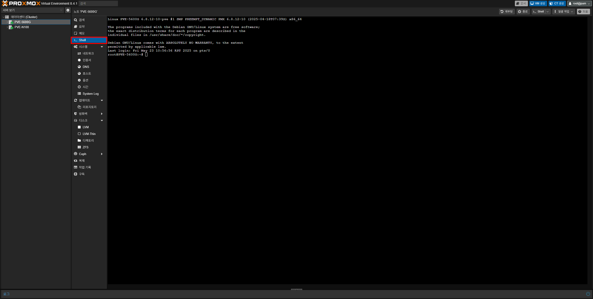

{}
IP가 바뀌어 웹 인터페이스에 접근이 불가능한 경우 모니터를 연결하여 CLI 환경에서도 가능해요.
{}

우선 Proxmox 웹 인터페이스에서 노드를 선택 후 좌측 메뉴의 **Shell**을 여세요. (노드 이름은 설치시 지정한 호스트네임을 뜻해요)



쉘이 열리게 되면 아래 명령어를 입력하여 네트워크 인터페이스 파일을 여세요 (이 가이드에서는 nano를 사용하지만 vi를 사용해도 돼요):

```bash
nano /etc/network/interfaces
```

그러면 다음과 같은 내용이 보이게 돼요 (기본적인 틀은 비슷하지만 인터페이스와 IP 등은 달라요):

```yaml
# network interface settings; autogenerated
# Please do NOT modify this file directly, unless you know what
# you're doing.
#
# If you want to manage parts of the network configuration manually,
# please utilize the 'source' or 'source-directory' directives to do
# so.
# PVE will preserve these directives, but will NOT read its network
# configuration from sourced files, so do not attempt to move any of
# the PVE managed interfaces into external files!

auto lo
iface lo inet loopback

auto enp3s0
iface enp3s0 inet manual

auto vmbr0
iface vmbr0 inet static
        address 192.168.0.40/24
        gateway 192.168.0.1
        bridge-ports enp3s0
        bridge-stp off
        bridge-fd 0

source /etc/network/interfaces.d/*
```

이제 우리는 여기서 `iface vmbr0 inet static` 부분의 IP, 게이트웨이를 수정할 거에요. 설명하기 전에 설정할 항목들에 대해 간단하게 설명할 테니 읽어보세요.

1. **address**:
Proxmox에 접속할 IP에요. IP 형식은 `IP주소/CIDR`이여야 하며 IP는 공유기에서 할당된 범위 내에서 설정해야 해요. CIDR은 대부분 `/24`를 사용하지만 좀 더 자세히 알아볼려면 [여기](https://aws.amazon.com/ko/what-is/cidr/)를 방문하여 알아볼 수 있어요.

2. **gateway**:
`공유기에 접속하는 IP 주소`를 말해요. 윈도우 기준으로 `ipconfig`를 입력하여 게이트웨이 주소를 확인할 수 있어요.

    ipconfig 예시:
    ```plaintext
    Ethernet adapter Ethernet:

        Connection-specific DNS Suffix  . :
        Link-local IPv6 Address . . . . . : XXXX:XXXX:XXXX:XXXX:XXXX:XXXX:XXXX:XXXX%8
        IPv4 Address. . . . . . . . . . . : 192.168.0.100
        Subnet Mask . . . . . . . . . . . : 255.255.255.0
        Default Gateway . . . . . . . . . : 192.168.0.1
    ```

먼저 `address` 부분을 수정할게요. 공유기에서 할당 가능한 IP 범위(대부분의 경우 2~255) 내에서 **현재 사용하지 않는 IP**를 확인하여 원하는 IP로 변경하세요. 다른 기기에서 IP를 사용하고 있다면 충돌이 나서 문제가 생겨요.

변경 하였다면 이제 `gateway` 부분을 수정해야 해요. 같은 공유기에서 IP만 변경하는 거라면 넘어가도 되지만, 공유기가 변경된 경우라면 변경해줘야 할 수도 있어요.

모든 변경이 끝났으면 **Ctrl + X -> Y**를 눌러 저장 후 빠져 나오고, 아래 명령어를 입력하여 네트워크 서비스를 재시작하세요. (자동으로 변경되지 않으니 반드시 해야해요):

```bash
systemctl restart networking
```

네트워크 서비스가 재시작 되었다면 이제 변경된 IP 주소로 들어가서 접속이 되는지 확인해보세요.
