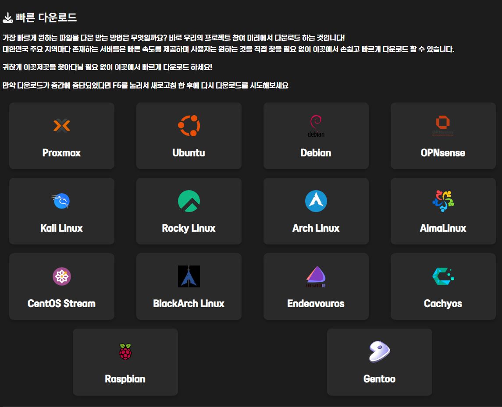
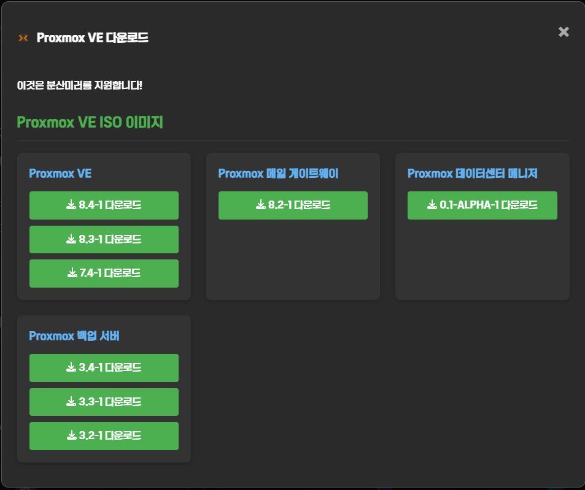
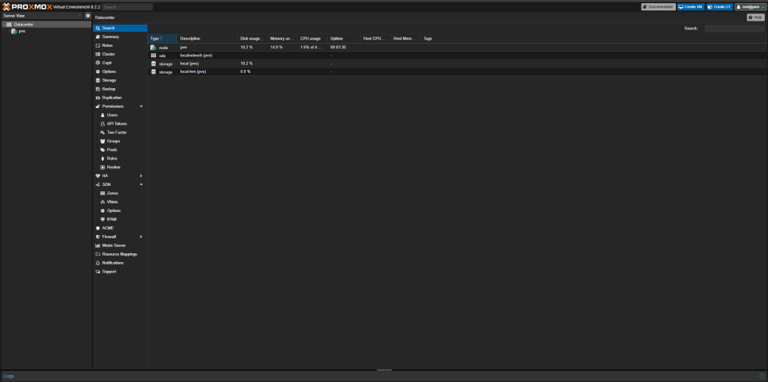

Proxmox를 설치하기 전에 아래 표를 참고하여 설치에 적합한지 확인하세요.

<table style="text-align: center; border-collapse: collapse; border-spacing: 0; width: 100%;">
  <thead>
    <tr>
      <th style="text-align: center; width: 15%;">항목</th>
      <th style="text-align: center; width: 42.5%;">최소</th>
      <th style="text-align: center; width: 42.5%;">권장</th>
    </tr>
  </thead>
  <tbody>
    <tr>
      <td>CPU</td>
      <td colspan="2">Intel 또는 AMD 기반의 x64 CPU</td>
    </tr>
    <tr>
      <td>RAM</td>
      <td>1GB (VM 메모리 별도)</td>
      <td>최소 2GB (VM 메모리 및 Ceph, ZFS용 메모리 별도)<br><strong>*추천: 16GB 이상</strong></td>
    </tr>
    <tr>
      <td>메인보드</td>
      <td colspan="2">Intel VT/AMD-V 지원 CPU 및 메인보드</td>
    </tr>
    <tr>
      <td>디스크</td>
      <td>하드 드라이브</td>
      <td>BBU(배터리로 보호되는 쓰기 캐시)가 있는 하드웨어 RAID<br>또는 ZFS가 있는 비 RAID 디스크</td>
    </tr>
    <tr>
      <td>NIC(LAN)</td>
      <td>1개</td>
      <td>1개 이상의 NIC</td>
    </tr>
    <tr>
      <td>기타</td>
      <td>-</td>
      <td>PCI(e) 패스스루의 경우 CPU에 VT-d/AMD-d 플래그 필요</td>
    </tr>
  </tbody>
</table>

{}
홈 서버 용도라면 소비자용 SSD를 사용해도 괜찮아요. [CrystalDiskInfo](https://crystalmark.info/en/software/crystaldiskinfo/) 또는 [smartctl](https://www.smartmontools.org/)로 먼저 상태를 확인해보세요.
{}

### Proxmox ISO 다운로드 및 부팅
우선 [ROKFOSS 프로젝트 공식 미러](https://http.krfoss.org/)에서 빠른 다운로드 항목의 Proxmox를 선택하세요.



다음으로 `Proxmox VE`에서 `8.4-1 다운로드`를 선택하여 다운로드하세요. (버전은 날짜에 따라 최신버전이 더 있을 수도 있으니 확인 후 진행하세요. 이번 가이드에서는 8.4-1로 진행해요)



이제 [Rufus](https://rufus.ie/ko/)나 [Ventoy](https://www.ventoy.net/) 같은 프로그램을 사용하여 설치 USB를 만들고 설치하려는 PC(서버)에 꽂은 뒤, 부팅 옵션 키를 눌러 해당 USB로 부팅하세요.

{}
부팅 옵션 키는 메인보드 제조사마다 달라요. 현재 사용중인 메인보드 제조사를 확인하여 미리 알아두세요.
{}

### 설치
아래와 같은 화면이 뜨면 일반적으로는 **Install Proxmox VE (Graphical)** 을 눌러 들어가세요.


만약 검은 화면에서 멈춰있다면 강제 재부팅하여 위 화면으로 다시 돌아오고 [이 가이드](https://svrforum.com/svr/1650986)를 참고하여 nomodeset 옵션을 추가해야 해요. (또는 8.0 ISO로 설치하여 Advanced Options로 들어가 nomodeset 옵션이 붙은 상태로 설치하고 최신 버전으로 업데이트 할 수도 있어요)

아래와 같은 화면이 뜨면 이제 설치를 진행할 수 있어요. **I agree**를 눌러 넘어가세요.


여기에서는 설치 디스크를 선택할 수 있어요. 설치한 디스크가 2개 이상이면 디스크 이름 옆의 ▼를 눌러 설치할 디스크를 선택하세요.

설치할 디스크 이외에도 ZFS, RAID 구성을 할 수 있지만 이번 가이드에서는 ext4로 설치할 거에요.


이제 국가 및 시간대를 설정해야 해요. 국가 및 시간대가 자동으로 잡히는 경우가 있지만 한 번씩 실패하는 경우가 있으니 아래와 같이 되어있는지 확인하세요.

```
Country - South Korea
Time zone - Asia/Seoul (South Korea 선택 시 자동)
Keyboard Layout - U.S. English
```


국가 및 시간대 설정이 끝났다면 root 비밀번호와 이메일을 설정하여야 해요. root는 모든 권한이 있는 계정이므로 신중하게 설정하세요. (비밀번호를 분실 하였다면 복구할 수는 있지만 외부 개방이 되어있다면 보안상의 위험이 있을 수 있어요)


이제 마지막으로 네트워크 설정만 하면 끝나요. 이번에도 자동으로 되는 경우가 있지만 한 번씩 안될 때도 있어요. 아래 설명을 참고하여 맞게 되어있는지 확인하세요.

1. **Management Interface**:
Proxmox에서 사용할 네트워크 인터페이스(랜카드)를 선택해주면 돼요. 보통 하나라면 자동으로 되어있지만 2개 이상이라면 연결된 랜카드를 선택하세요.

2. **Hostname (FQDN)**:
`pve.localdomain`과 같이 `서버이름.도메인` 형식으로 서버 이름을 입력해주면 돼요. 이 이름은 내 네트워크에서 서버를 식별하는 데 사용해요. <br>
FQDN이 무엇인기 궁금하다면 [여길](https://www.f5.com/ko_kr/glossary/fqdn) 읽어보세요.

3. **IP Address (CIDR)**:
공유기에 할당 될 IP 주소를 입력하면 돼요. 보통 이 부분은 자동으로 되어있지만 IP 할당에 실패하면 수동으로 입력해줘야 해요. 현재 사용중인 공유기의 네트워크 설정을 확인하여 `192.168.0.190`과 같이 설정하세요. 뒤에 있는 `24`는 특수한 경우가 아니라면 신경쓰지 않아도 괜찮아요.

4. **Gateway**:
공유기의 관리페이지에 들어갈 때 사용하는 IP에요. 윈도우의 경우라면 cmd에서 `ipconfig`를 입력하여 `기본 게이트웨이` 항목에서 확인할 수 있어요.
```
Ethernet adapter Ethernet:

   Connection-specific DNS Suffix  . :
   Link-local IPv6 Address . . . . . : XXXX::XXXX:XXXX:XXXX:XXXX%XX
   IPv4 Address. . . . . . . . . . . : 192.168.0.100
   Subnet Mask . . . . . . . . . . . : 255.255.255.0
   Default Gateway . . . . . . . . . : 192.168.0.1
```

5. **DNS Server**:
IP 할당이 되어있다면 기본적으로 공유기에서 설정 된 DNS 주소를 사용하지만 설정이 되어있지 않거나 원한다면 Cloudflare DNS(1.1.1.1)나 Google DNS(8.8.8.8)로 변경하여 사용할 수 있어요.


설정이 완료되었다면 요약이 표시돼요. 설정한 항목이 맞다면 **Install**을 누르세요.


설치가 완료되었다면 **Reboot**을 눌러 수동으로 재부팅 하거나 몇 초 이내에 자동으로 재부팅이 되는데 이 때 USB를 제거하세요. 그러면 아래와 같은 화면이 나타나요.

이제 브라우저로 화면에 표시된 `https://IP주소:8006`에 접속할 수 있어요.


{}
기본 상태에서는 IP로 접속하게 되면 `연결이 비공개로 설정되어 있지 않습니다.`가 표시되는데 `고급 - 'IP주소(안전하지 않음)'`을 클릭하면 들어갈 수 있어요.
{}


