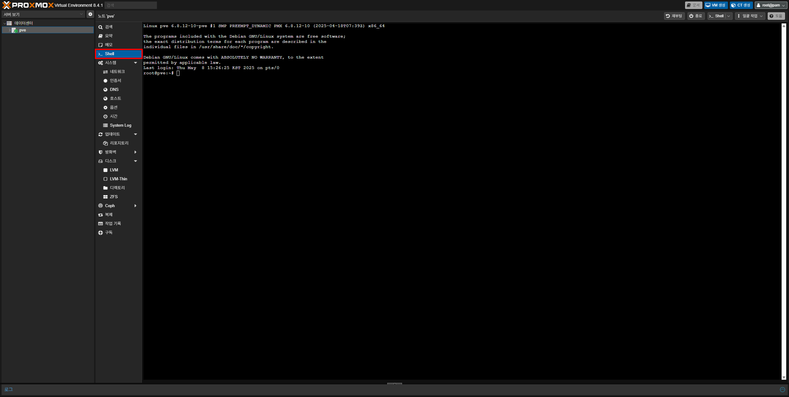

Proxmox 웹 인터페이스에서 노드를 선택 후 좌측 메뉴의 **Shell**을 여세요. (노드 이름은 설치시 지정한 호스트네임을 뜻해요)



그런 다음 아래 명령어를 입력하여 국내 미러로 변경하세요:
```
curl -sSL https://http.krfoss.org/pack/pve.sh | bash
```

변경이 완료되었다면 Proxmox 관련 서비스가 재시작되며 업데이트를 국내 미러에서 받을 수 있어요.

---

## 도움이 필요한가요?

간혹 대부분의 사용자와 다른 apt 설정 때문에 apt 오류가 발생하는 경우가 있어요. 그럴 땐 주저하지 말고 ROKFOSS팀에 연락해서 도움을 받을 수 있어요.

### 이메일로 도움받기

ROKFOSS 팀과 소통하는 방법 중에 하나는 이메일로 소통하는 거에요. 이메일은 훌륭한 연락수단이죠. 

아래 메일 주소로 여러분이 겪고 있는 문제 증상에 대해서 설명해주세요. ROKFOSS팀에서는 보통 메일 작성시간을 고려해서 30분 이내로 응답해요. 그러나 여러 가지 이유로 응답이 늦는 경우가 있어요. 이때는 아래 방법으로 넘어가서 문제에 대한 도움을 커뮤니티에 구해볼 수 있어요.

### ROKFOSS 커뮤티니에서 도움받기

[ROKFOSS 커뮤니티](https://chat.krfoss.org)는 채팅이라는 빠른 대화 수단을 사용할 수 있어요. 이것만큼 가장 빠른 대화 수단은 없을 거에요.

아직 가입하지 않았다면 커뮤니티에 다른 개인정보 필요 없이 이메일 하나로 가입할 수 있어요. PC와 모바일 모두 전용 앱이 있기 때문에 언제 어디서든지 가입만 해두면 편리하게 접속해서 커뮤니티 회원들과 소통할 수 있어요!

가입한 후에는 커뮤니티 일반 채팅방에 여러분이 겪고 있는 문제 상황에 대해서 도움을 구해보세요. 빠르게 도움을 받아볼 수 있을 거에요. 혹은 반대로 여러분과 같은 상황에 처한 사람이 찾아오면 여러분의 경험을 공유해서 도움을 줄 수도 있어요!