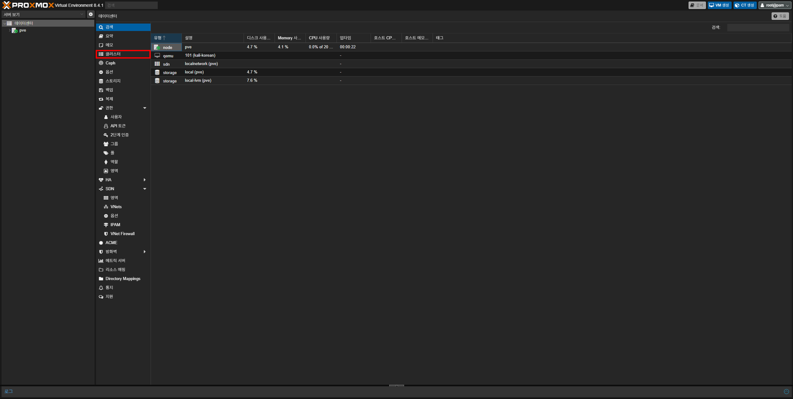
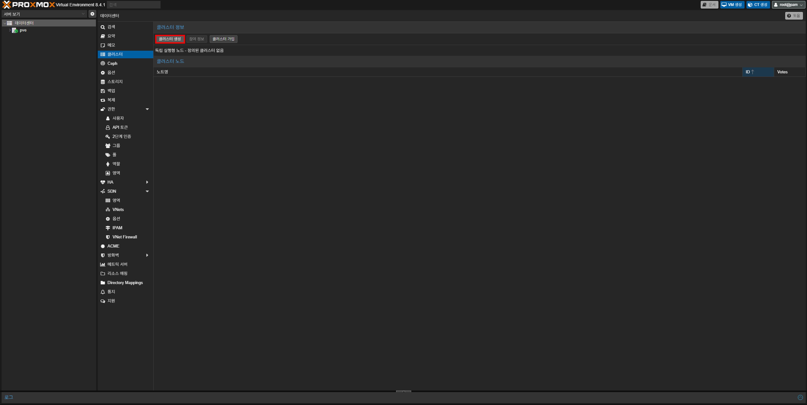
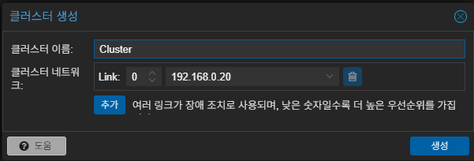
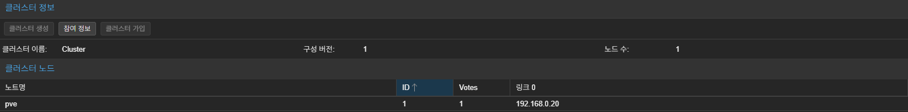
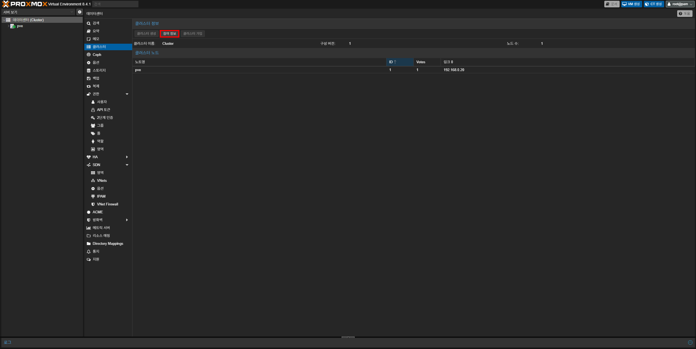
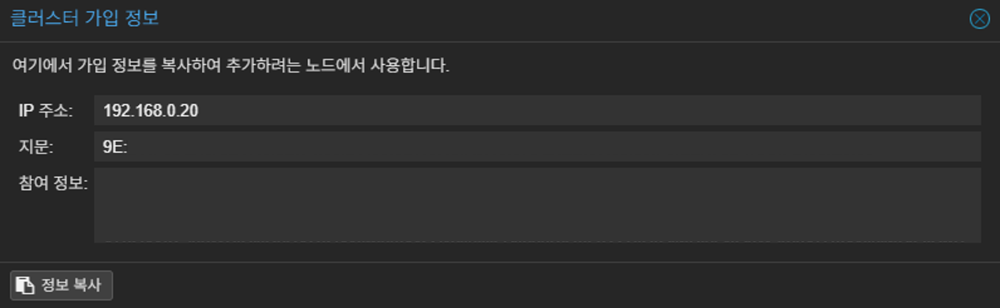
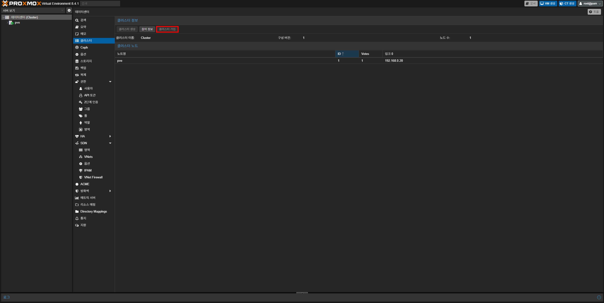

{}
클러스터를 구축하기 전에 **같은 네트워크에 있고 동일한 버전으로 구성**되어 있는 서버 두 대 이상이 필요해요.

여기서는 서버 대신 `노드`라는 명칭을 사용해요.
{}

우선 Proxmox 웹 인터페이스에 접속하고, **데이터센터 - 클러스터**로 이동하세요.



이동하였으면 아래 절차를 따라 클러스터를 생성하고 다른 노드에서 생성된 클러스터에 가입하면 돼요.

### 클러스터 생성하기
상단에 있는 **클러스터 생성** 버튼을 클릭하세요.



`클러스터 생성`이라는 창이 표시되면 원하는 이름을 입력 후 **생성** 버튼을 누르세요. 이 가이드에서는 Cluster라는 이름으로 진행해요. (2개 이상의 NIC를 보유하고 있고 각각 다른 사설 IP를 받아온다면 IP 옆의 ▼를 눌러 변경할 수 있어요)



잠시 기다리면 `데이터센터` 옆에 클러스터 이름이 표시되고 `클러스터 노드`에 노드 이름이 표시되는 것을 볼 수 있어요.



### 클러스터 가입하기
{}
클러스터를 가입하려면 가입하려는 노드에 VM 또는 LXC가 없어야 들어갈 수 있어요.
{}

다른 노드에서 클러스터를 가입하려면 클러스터를 생성한 노드의 `참여 정보`가 필요해요. 상단의 **참여 정보** 버튼을 클릭하세요.



누르게 되면 아래와 같은 정보가 표시돼요. **정보 복사** 버튼을 클릭 후 창을 닫고, **클러스터 가입** 버튼을 클릭하세요.





`클러스터 가입` 창이 표시되면 정보에 복사한 참여 정보 값을 붙여 넣고, `비밀번호` 항목에 **클러스터를 생성한 노드의 root 비밀번호**를 입력하세요. 마지막으로 `클러스터 네트워크`에서 **클러스터 통신에 사용할 IP**를 선택하고 **참여 (클러스터 이름)**을 누르면 몇 초 뒤에 자동으로 가입이 돼요.


### "Cluster not ready - no quorum?"이 표시될 때
클러스터로 구축한 서버 중 한 대가 꺼져 있으면 이 문제가 발생할 수 있어요.

다음 명령어를 접속하는 노드 중 한 곳(현재 접속된 노드의 웹 인터페이스)의 쉘에서 다음 명령어를 입력하세요:

```bash
pvecm expected 1
```
