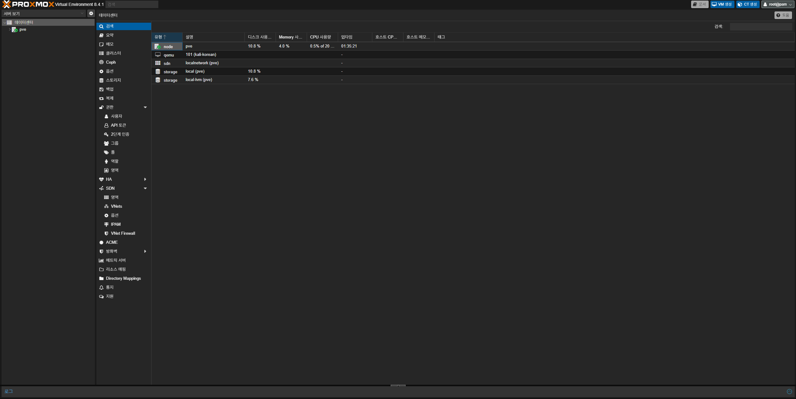
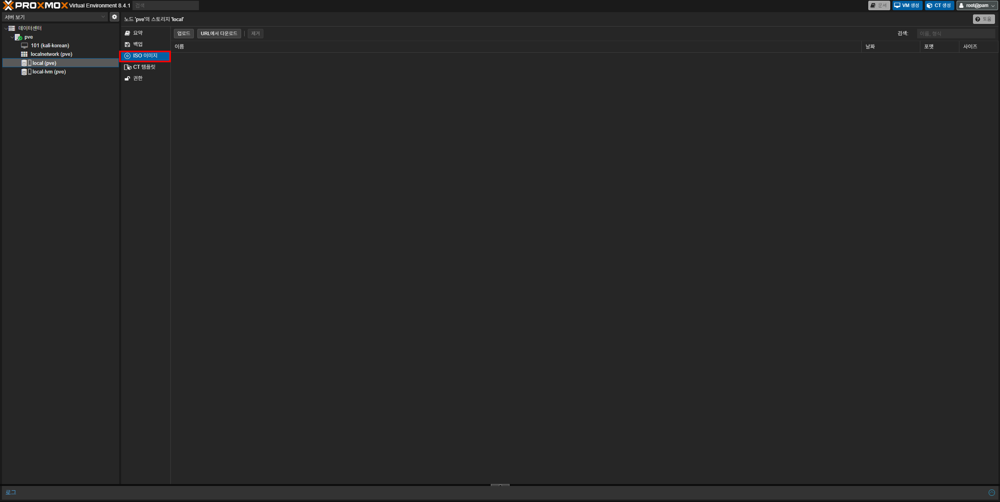
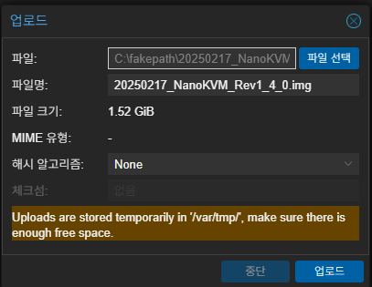
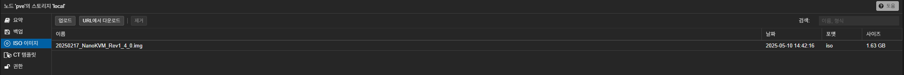

이 가이드에서는 Proxmox에 ISO 업로드를 하는 방법에 대해 다뤄요.

### 업로드 방식
Proxmox에서는 두 가지의 업로드 방식을 지원해요.

1. **웹 인터페이스 방식**:
Proxmox의 웹 인터페이스에 접속하여 업로드하는 방식이에요. 사용하기가 쉽고 보편적으로 써요.
2. **SCP를 이용한 방식**: 
SCP 명령어를 통해 Proxmox의 ISO 폴더에 업로드하는 방식이에요.

### 1. 웹 인터페이스로 업로드하기
우선 Proxmox의 웹 인터페이스에 접속해야 해요. `https://IP주소:8006`을 브라우저 주소창에 입력하여 들어가고 root 계정으로 로그인하세요.

그러면 아래와 같이 `데이터센터` 항목이 선택된 상태로 창이 뜨게돼요:



이제 노드에 속해있는 `local`을 선택 후 **ISO 이미지**를 선택하세요.



이제 두 가지 방법을 사용하여 받을 수 있어요. 이 가이드에서는 첫 번째 방법을 사용해요.

1. **직접 업로드하기**:
상단의 `업로드` 버튼을 눌러 PC에 저장된 iso를 업로드할 수 있어요.
2. **URL에서 다운로드하기**: PC가 아닌 특정 사이트에서 바로 다운로드 하는걸 의미해요. URL이 `~/파일명.iso`로 끝나야 사용할 수 있어요.

먼저 상단의 `업로드` 버튼을 누른 뒤, `파일 선택` 버튼을 눌러 PC에 저장된 iso를 선택하세요. 파일명과 파일 크기가 맞게 바뀌었다면 하단의 `업로드` 버튼을 클릭하세요.

{}
업로드 시 임시로 `/var/tmp` 경로에 저장되니 파일 크기 이상으로 여유 공간이 있는지 확인하세요.
{}



업로드가 완료되었다면 iso가 있는 것을 볼 수 있어요:



### 2. SCP로 업로드하기
{}
이 방식은 초보자에게 어려울 수 있으며 IP 주소는 Proxmox의 IP 주소를 의미해요.
{}

우선 Windows에서는 cmd나 Powershell, Linux에서는 터미널을 열고 cd로 iso가 있는 폴더로 이동하세요 (절대경로 입력을 원하면 넘어가도 돼요):

```
cd iso가_있는_경로
```

그런 다음 아래 명령어를 입력하여 Proxmox로 파일 전송을 시작하세요:

```
scp iso절대경로_또는_파일명.iso 'root@IP주소:/var/lib/vz/template/iso'
```

만약 아래와 같은 내용이 표시되었다면 `yes`를 입력하고, root 계정의 비밀번호를 입력후 엔터를 누르세요.

{}
SSH를 사용하여 접속하는 것이기에 비밀번호가 표시되지 않아요.
{}

```
The authenticity of host '192.168.0.20 (192.168.0.20)' can't be established.
ED25519 key fingerprint is SHA256:Ab1CdeFgHIjkLMNoPqRsTuVwXyZ1234567890abcdEf.
This key is not known by any other names.
Are you sure you want to continue connecting (yes/no/[fingerprint])?
```

```
root@192.168.0.20's password:
```

비밀번호 입력이 완료되었으면 파일전송이 시작돼요. 이 때 파일 용량에 따라 시간이 오래 걸릴 수 있어요.

파일 전송이 끝나면 이제 Proxmox로 돌아와 ISO가 업로드 되어있는지 확인하세요.