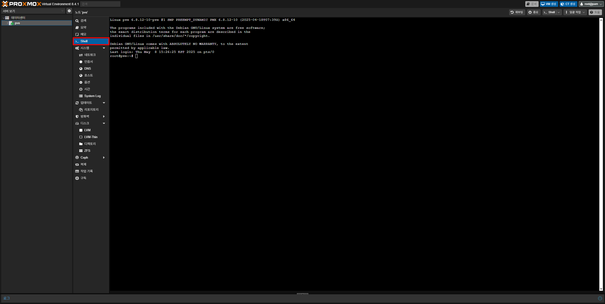
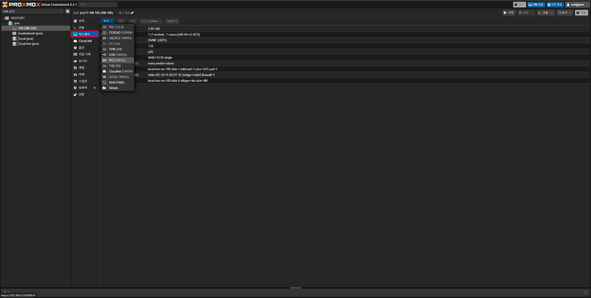
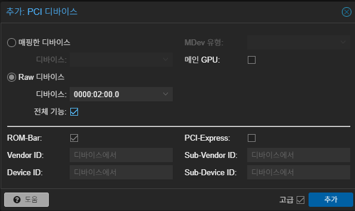
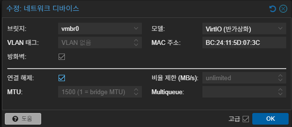

{}
이 가이드를 따르기 전에 반드시 [Proxmox 패스스루 설정하기]()를 따라야 해요.

또한 아래 내용은 엔비디아 GPU를 기준으로 작성되었으며 라데온 또는 내장 그래픽의 경우 방법이 다를 수 있어요.
{}

우선 Proxmox 웹 인터페이스에서 노드를 선택 후 좌측 메뉴의 **Shell**을 여세요.



그런 다음 아래 명령어를 입력하여 현재 GPU 정보를 확인하세요.

```bash
lspci -nn | grep VGA
```

실행하게 되면 다음과 같은 내용이 보이게 돼요. 기억하기 어렵다면 다른 곳에 저장해 두세요.

```plaintext
02:00.0 VGA compatible controller [0300]: NVIDIA Corporation GP107 [GeForce GTX 1050] [10de:1c81] (rev a1)
```

이제 VM을 생성할게요. [다음 가이드](https://docs.krfoss.org/proxmox/proxmox%EC%97%90%EC%84%9C-vm-%EC%83%9D%EC%84%B1%ED%95%98%EA%B8%B0/)를 참고하여 VM을 Q35 / OVMF (UEFI), CPU 타입은 host로 생성하세요. (사전 등록 키는 해제하는 게 좋아요)

생성이 완료되었으면 VM의 전원을 키고 OS 설치 및 설정은 완료하세요.

생성이 완료되었다면 엔비디아 드라이버를 받을 차례에요. VM에서 [엔비디아 공식 홈페이지](https://www.nvidia.com/ko-kr/drivers/)에서 `.exe (윈도우)`나 `.run (리눅스)`으로 끝나는 드라이버 파일을 받으세요.


파일 다운이 완료되었으면 VM의 전원을 끄고 **하드웨어 - 추가 - PCI 디바이스**를 누르세요.



`PCI 디바이스 추가` 창이 나타나게 되면, **Raw 디바이스**를 선택하고 `디바이스`에서 이전에 확인한 GPU를 선택하세요. 이때 **전체 기능과 고급 옵션의 PCI-Express에 체크**하는 것을 잊지 마세요.



VM을 켤 준비가 되었다면 OS가 윈도우일 경우 일시적으로 하드웨어에서 **네트워크 디바이스**를 선택 후 **연결 해제**를 누르세요. 이 작업은 윈도우에서 드라이버가 자동으로 설치되는 것을 막기 위함이에요. (**리눅스의 경우 안해도 돼요**)



이제 드라이버를 설치할게요. 윈도우의 경우 `.exe` 파일을 그냥 실행하면 되지만, 리눅스의 경우 드라이버를 설치하는 데 필요한 패키지가 필요해요. 설치 및 실행을 위해서 다음 명령어를 차례대로 실행하세요. (이 가이드에서는 우분투와 데비안, RHEL 계열 OS만 설명할 거에요)

```bash
# 우분투, 데비안의 경우:
sudo apt-get install build-essentials

# CentOS, 록키/알마리눅스의 경우:
sudo dnf install gcc make kernel-devel kernel-headers elfutils-libelf-devel
```

```bash
sudo chmod +x NVIDIA_Linux_x86_64_드라이버버전.run

sudo ./NVIDIA_Linux_x86_64_드라이버버전.run
```

정상적으로 설치가 완료되었다면 재부팅 후 윈도우의 경우 `작업 관리자`, 리눅스의 경우 CLI(GUI의 경우 터미널)에서 `nvidia-smi`를 입력하여 GPU가 정상적으로 표시되는지 확인하세요. (아래의 경우 리눅스에서 표시되는 예시에요)

```plaintext
+---------------------------------------------------------------------------------------+
| NVIDIA-SMI 535.104.05              Driver Version: 535.104.05    CUDA Version: 12.2   |
+-------------------------------+----------------------+--------------------------------+
| GPU  Name           Persistence-M | Bus-Id        Disp.A | Volatile Uncorr. ECC       |
| Fan  Temp  Perf  Pwr:Usage/Cap    | Memory-Usage         | GPU-Util  Compute M.       |
|===================================+======================+============================|
|   0  NVIDIA RTX 3060       On     | 00000000:01:00.0 Off | N/A                        |
|  30%   43C   P8    12W / 170W     | 420MiB / 12288MiB    | 1%       Default           |
+-------------------------------+----------------------+--------------------------------+

+---------------------------------------------------------------------------------------+
| Processes:                                                                  GPU Memory|
|  GPU       PID   Type   Process name                                        Usage     |
|=======================================================================================|
|    0      3024   G      /usr/lib/xorg/Xorg                                   198MiB   |
|    0      4211   G      /usr/bin/gnome-shell                                 112MiB   |
|    0      5123   G      ...RendererForSitePerProcess                         110MiB   |
+---------------------------------------------------------------------------------------+
```
