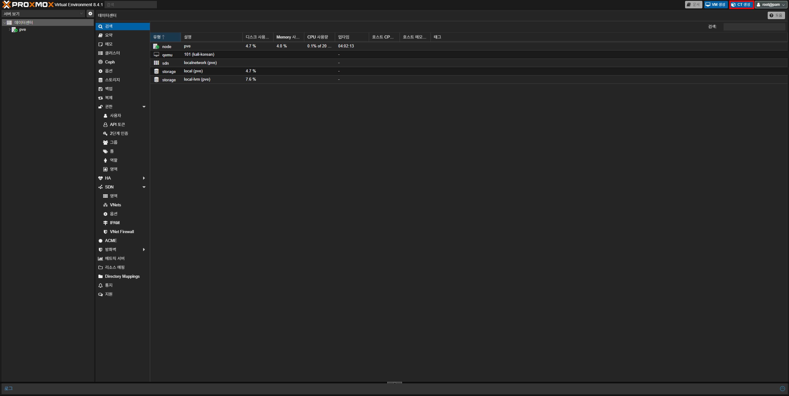
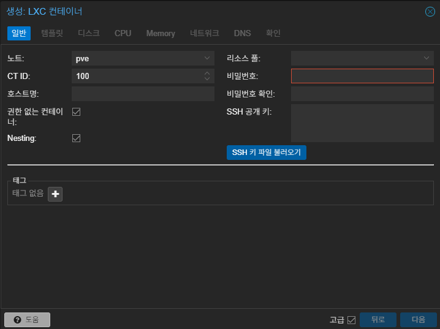
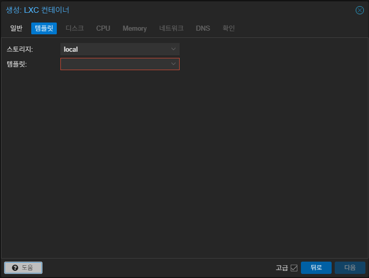
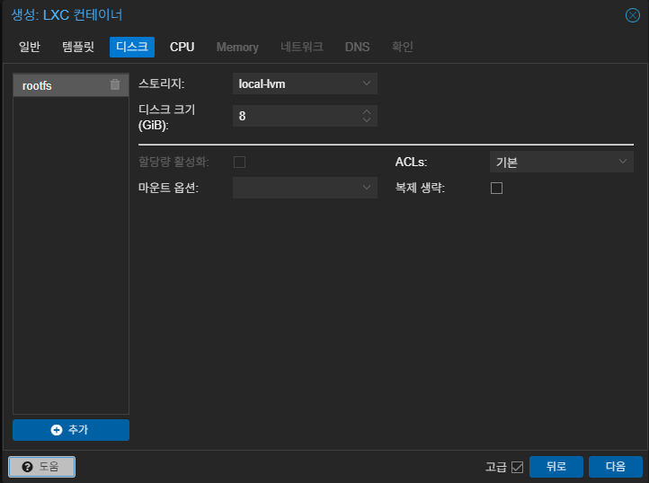
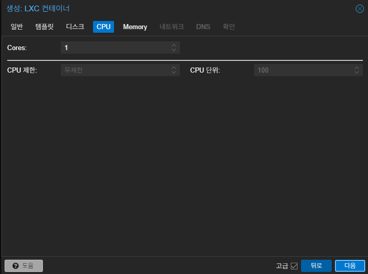
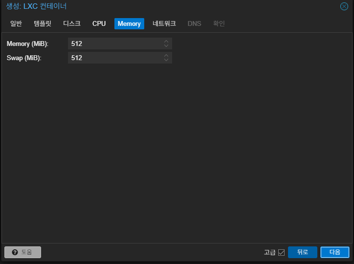
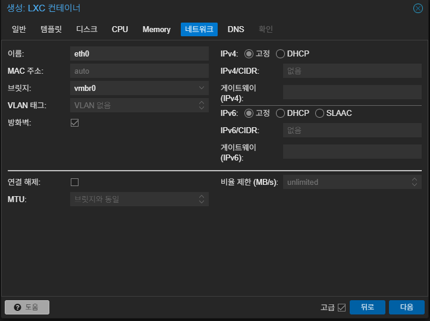
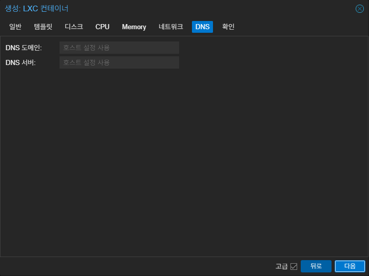
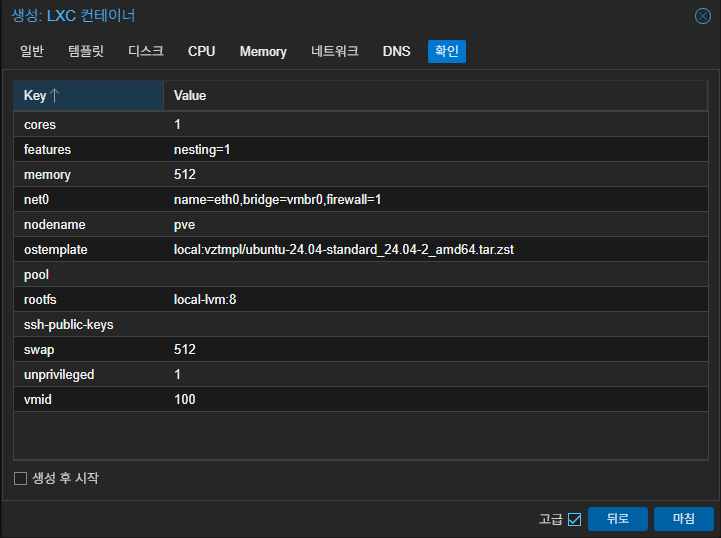

먼저 Proxmox 웹 인터페이스를 열고 우측 상단의 **CT 생성**을 누르세요.



`호스트명`과 `비밀번호`를 입력하세요. 권한 없는 컨테이너와 Nesting은 특수한 경우가 아니라면 두는 것이 좋아요.

{}
`권한 없는 컨테이너`에 대해 궁금하다면 [여기](https://svrforum.com/svr/1539400)를 참고해 보세요.
{}



설치할 OS의 템플릿을 선택하세요.



디스크는 아래 설명을 참고하여 설정하는게 좋아요:

1. **스토리지**:
기본적으로 `local-lvm`가 선택되며 별도 디스크를 LVM이나 LVM-Thin 등으로 추가한 상황이라면 해당 디스크를 선택해도 돼요.

2. **디스크 크기**:
LXC에서 사용할 저장 공간의 크기를 의미해요. 스토리지에서 선택한 디스크의 용량 내에서 설정하면 돼요. (여기서 디스크 용량은 SSD/HDD의 전체 용량이 아닌 `local-lvm에 할당된 크기`를 의미해요)

이외에도 몇 가지가 더 있지만, 여기서는 다루지 않을 거에요.



이제 CPU를 설정할 차례에요. VM에서는 다양한 설정들이 있었지만 LXC는 `코어 수, CPU 제한, CPU 단위`만 설정이 가능해요. `Cores` 값을 현재 설치된 CPU의 코어 수 내에서 자유롭게 설정하세요.



메모리의 경우 현재 장착된 RAM의 용량 내에서 설정해야 하며 VM과 달리 LXC는 경량화되어 있기에 VM처럼 많은 램을 할당하지 않아도 돼요. 환경에 맞게 설정하세요.

스왑은 RAM이 부족할 시 `디스크 일부를 가상 메모리로 사용하여 작업을 원활히 해주는 기능`을 해요. 이 또한 환경에 따라 필요할 수도 있지만 필요없거나 원치 않는다면 **0**을 입력하여 비활성화 할 수 있어요.

{}
swap에 대해 궁금하다면 [이 문서](https://docs.redhat.com/ko/documentation/red_hat_enterprise_linux/7/html/storage_administration_guide/ch-swapspace)를 확인해 보세요.

GB를 MiB로 변환하려면 [이 사이트](https://www.gbmb.org/gb-to-mb)를 사용하세요. 바이너리로 변환된 값을 사용하면 돼요.

{}



마지막으로 네트워크와 DNS를 설정하면 끝나요. 네트워크는 IPv4만 설정할 거니 IPv6는 고정으로 두세요. IPv4에 대한 설정은 아래 설명을 참고하여 하면 돼요:

{}
IPv4의 할당 방식이 DHCP로 되어있는 경우 2번 항목부터 나타나지 않아요.
{}

1. **IPv4**:
`고정`은 공유기에서 사용 가능한 IP 범위 내에서 직접 설정하는 것이고 `DHCP`는 공유기에서 자동적으로 할당하는 것을 말해요. 가급적이면 고정을 선택하는 것이 낫지만, DHCP를 선택해도 무관해요.

2. **IPv4/CIDR**:
공유기에 할당할 IPv4 주소와 CIDR을 설정할 수 있어요.

3. **게이트웨이 (IPv4)**:
공유기의 관리페이지에 들어갈 때 사용하는 IP에요. 윈도우의 경우라면 cmd에서 `ipconfig`를 입력하여 `기본 게이트웨이` 항목에서 확인할 수 있어요.

```plaintext
Ethernet adapter Ethernet:

   Connection-specific DNS Suffix  . :
   Link-local IPv6 Address . . . . . : XXXX::XXXX:XXXX:XXXX:XXXX%XX
   IPv4 Address. . . . . . . . . . . : 192.168.0.100
   Subnet Mask . . . . . . . . . . . : 255.255.255.0
   Default Gateway . . . . . . . . . : 192.168.0.1
```



DNS의 경우 Proxmox에 설정되어 있는 DNS를 사용할 거니 넘어가세요. (원한다면 Cloudflare DNS(1.1.1.1)과 같은 공개 DNS로 바꿔도 돼요)



지금까지 설정한 항목들이 맞으면 **마침**을 눌러 끝내세요. LXC가 자동으로 시작되길 원한다면 **생성 후 시작**을 선택하고 마침을 누르면 돼요.


