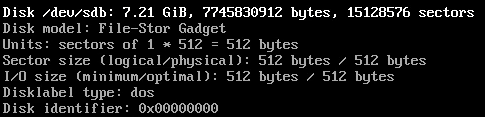
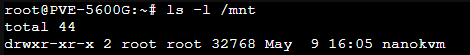
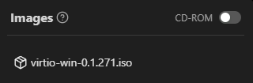

{}
이 문서에 나온대로 하려면 반드시 ISO 파일이 있는 서버에 nanokvm이 연결되어 있어야 해요. 
{}

우선 아래 명령어를 입력해주세요.
``` bash
fdisk -l
```
그럼 아래와 같은 예시로 출력될 거에요. `File-stor Gadget`으로 뜨는 걸 찾아주세요.



그런 다음 /mnt에 마운트시킬 폴더를 `mkdir /mnt/폴더명` 으로 생성해주세요. (이름은 아무거나 해도 상관 없지만, 여기서는 `nanokvm`으로 진행했어요.)



이제 `mount /dev/sdX /mnt/폴더명`으로 nanokvm을 마운트 시켜주고 `cd /mnt/폴더명`으로 이동해주세요.
``` bash
root@PVE~5600G:~# mount /dev/sdb/ /mnt/nanokvm && /mnt/nanokvm
```

이동이 완료되었으면 Proxmox에서 ISO가 저장되는 경로 `(/var/lib/vz/template/iso 또는 /mnt/pve/디스크명/template/iso 등)`에서 cp로 옮겨주세요. (마운트된 폴더에 있을경우 . 입력해주면 현재경로로 지정됩니다)
``` bash
root@PVE~5600G: /mnt/nanokvm# cp /mnt/pve/HDD/template/iso/virtio-win-0.1.271.iso .
```

이제 nanokvm으로 들어가서 images를 눌러 확인해보면 추가된 것을 볼 수 있어요.



ISO 업로드가 끝났다면 반드시 `umount /mnt/폴더명`으로 마운트를 해제해주세요. (target is busy가 뜰경우 폴더 안에 있어서 그런거니 cd ..로 나오고 해주면 정상적으로 명령어가 실행되는 걸 볼 수 있어요.)

``` bash
umount /mnt/nanokvm
```