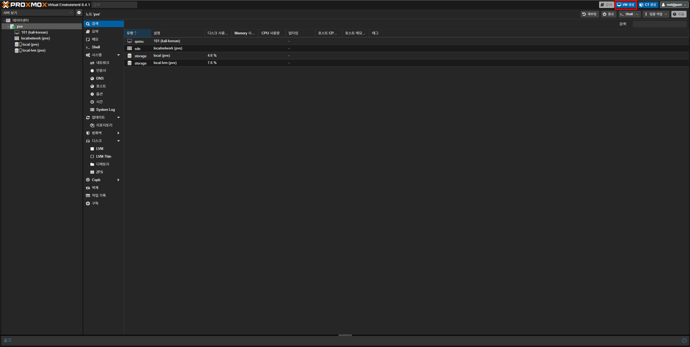
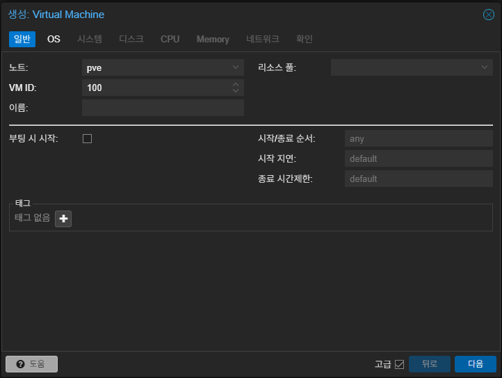
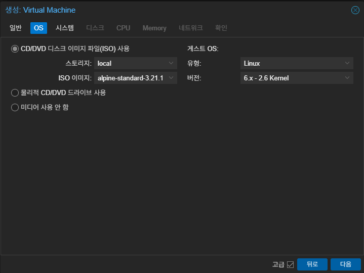
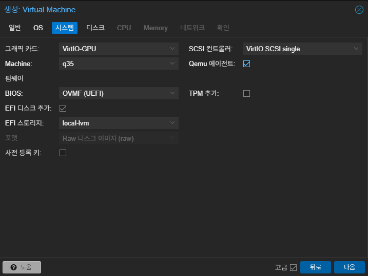
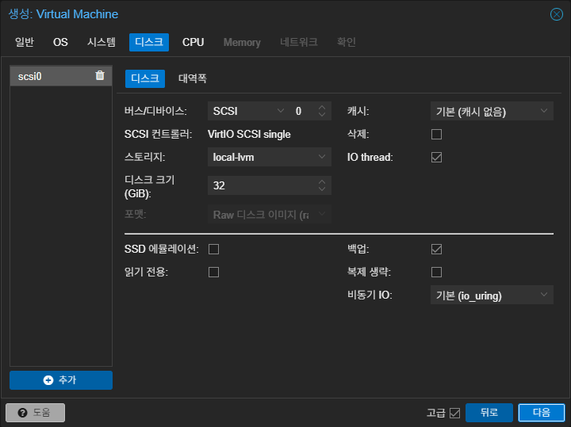
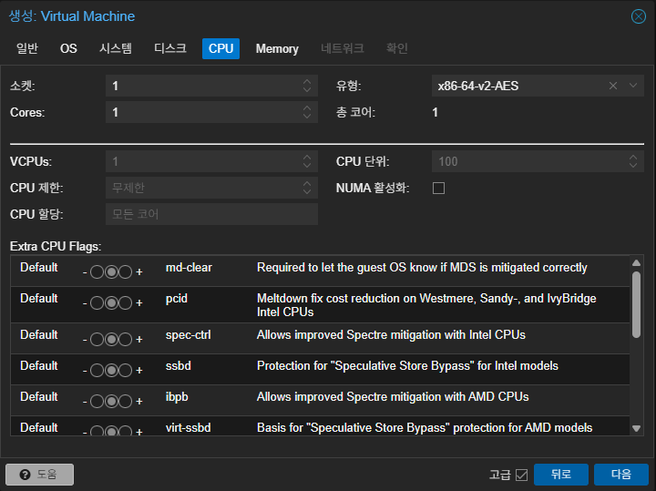
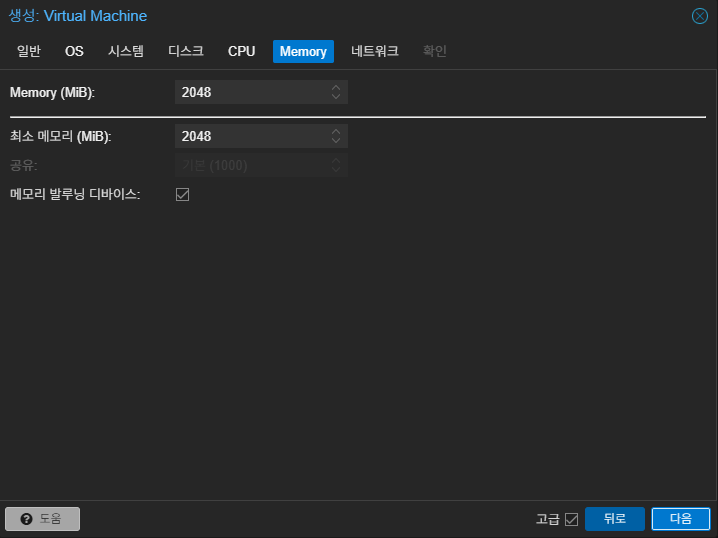
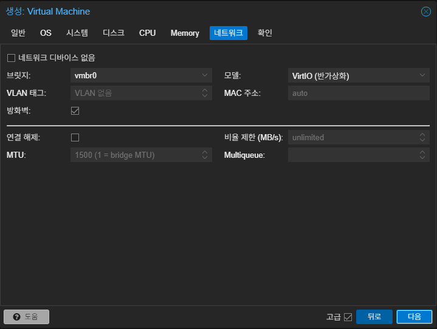
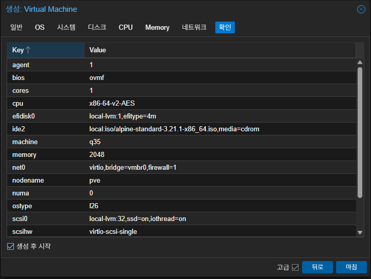

먼저 Proxmox 웹 인터페이스를 열고 우측 상단의 **VM 생성**을 누르세요.

VM을 생성하는 창이 뜨면 이름을 지정하고 **부팅 시 시작** 항목을 선택하세요. (원하는 경우 VM ID를 100 이상의 숫자로 바꾸거나 이름을 생략하고 넘어가도 돼요)

기본적으로 선택된 `CD/DVD 디스크 이미지 파일(ISO) 사용`의 `ISO 이미지`에서 설치를 원하는 OS의 ISO 이미지를 선택하고, `게스트 OS`에서 `유형과 버전`을 올바르게 선택하세요. 이 가이드에서는 Linux를 에를 들어 설명할게요.

{}
대부분의 Linux 종류는 `Linux, 6.x - 2.6 Kernel`을 선택하고 Windows라면 `Windows`를 선택 후 OS 버전에 맞게 선택해야 해요.

Windows를 사용할 예정이라면 하단에 표시되는 **VirtIO 드라이버용 드라이브 추가**를 선택하세요.
{}

GUI를 사용하는 OS라면 `그래픽 카드`를 **VirtIO-GPU**로 선택하고 아니라면 **기본** 상태로 두세요.

나머지는 아래 사진과 동일하게 하면 돼요.

디스크는 아래 설명을 참고하여 설정하는게 좋아요:

1. **버스/디바이스**:
`IDE, SATA, VirtIO Block, SCSI`가 있으며 대부분의 사용자들은 `SATA 또는 SCSI`를 사용해요. SCSI를 사용하는 경우 `SCSI 컨트롤러`가 고정값으로 생기며 Windows를 설치할 목적으로 VM을 생성하고 있다면 SCSI는 설치 과정에서 드라이버 로드가 필요해요.

2. **스토리지**:
기본적으로 `local-lvm`가 선택되며 별도 디스크를 LVM이나 LVM-Thin 등으로 추가한 상황이라면 해당 디스크를 선택해도 돼요.

3. **디스크 크기**:
VM에서 사용할 저장 공간의 크기를 의미해요. 스토리지에서 선택한 디스크의 용량 내에서 설정하면 돼요. (여기서 디스크 용량은 SSD/HDD의 전체 용량이 아닌 `local-lvm에 할당된 크기`를 의미해요)

4. **SSD 에뮬레이션**:
SSD에 VM을 생성하는 경우라면 해당 기능을 사용할 수 있으며 HDD의 경우 의미 없는 설정이에요.

이외에도 다양한 설정들이 있지만 내용이 많은 관계로 다루지 않을 거에요.

이제 CPU를 설정할 차례에요. `소켓`은 기본값인 1로 설정하고 `Cores`는 현재 설치된 CPU의 코어 수 내에서 자유롭게 설정하세요. `유형`은 기본값인 `x86-64-v2-AES`로 둬도 작동상에 문제는 없지만, 가능하면 **host**로 설정하세요.

메모리의 경우 현재 장착된 RAM의 용량 내에서 설정해야 하며 Windows의 경우 4096 MiB 이상, Linux의 경우 2048 MiB 이상 하는 게 나아요. 

`메모리 발루닝 디바이스`는 선택된 상태로 두는 것이 좋아요.

{}
GB를 MiB로 변환하려면 [이 사이트](https://www.gbmb.org/gb-to-mb)를 사용하세요. 바이너리로 변환된 값을 사용하면 돼요.
{}

마지막으로 네트워크만 설정하면 끝나요. 필요에 따라 `모델`을 VirtIO (반가상화)가 아닌 다른 것으로 설정할 수도 있지만 대부분의 사용자는 변경이 필요하지 않으므로 넘어갈게요.

지금까지 설정한 항목들이 맞으면 **마침**을 눌러 끝내세요. VM이 자동으로 시작되길 원한다면 **생성 후 시작**을 선택하고 마침을 누르면 돼요.

