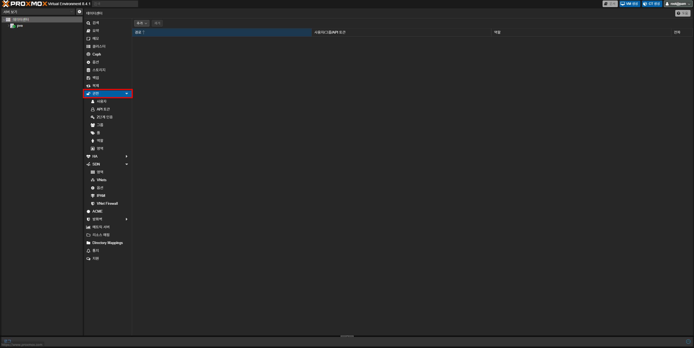
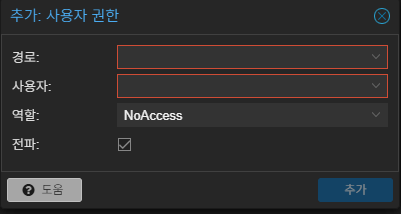
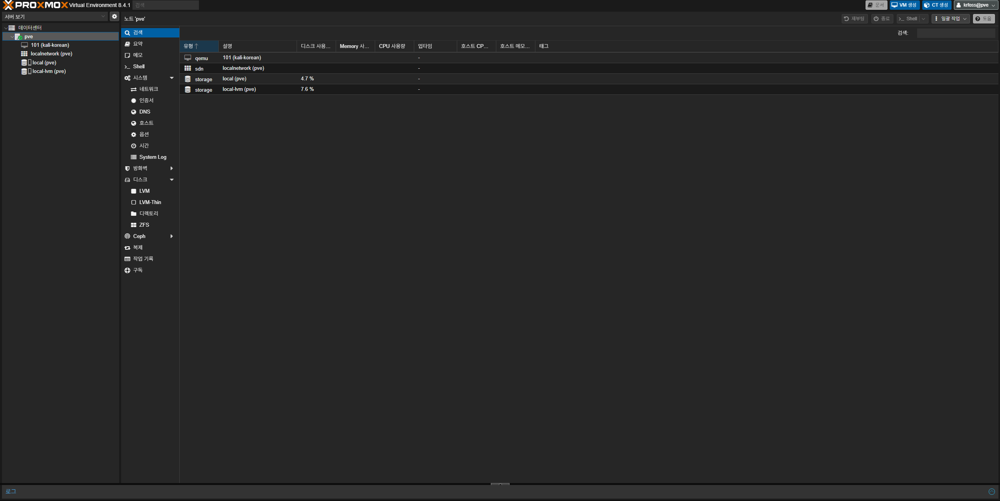

{}
이 가이드는 [Proxmox에서 사용자 생성하기](링크수정예정)와 이어지며 `root`로 로그인 후 진행하여야 해요.
{}

우선 Proxmox 웹 인터페이스를 열고 `데이터센터 - 권한`으로 이동하세요.

상단의 **추가 - 사용자 권한**을 클릭하세요. 클릭하면 아래와 같은 창이 표시돼요:

이제 아래 설명을 참고하여 권한 설정을 진행하세요.

1. **경로**:
Proxmox의 서비스, VM(LXC), 저장소 등을 나눠서 어떤 곳에 접근이 가능하게 할지 설정할 수 있어요. `루트(/)`를 선택하게 되면 모든 곳에 접근이 가능하고 `/vms/100`은 100번 VM에만 접근할 수 있다는 의미에요.

2. **사용자**:
어떤 사용자에게 권한을 줄지 설정할 수 있어요. 이전 가이드에서 생성한 사용자를 선택하면 돼요. (Proxmox 인증 서버를 사용하였으면 `krfoss@pve`와 같이 떠요)

3. **역할**:
권한을 줄 사용자에게 어떠한 권한을 줄지 설정할 수 있어요. 예를 들어 `PVEVMAdmin`같은 경우 VM의 모든 권한(전원 관리, 하드웨어 설정, 백업, 복제 등)을 준다는 것을 의미해요.

{}
권한과 관련된 설명은 [Proxmox 공식 문서(영문)](https://pve.proxmox.com/wiki/User_Management#pveum_permission_management)을 참고해 보세요.
{}

설정이 완료되었다면 **추가** 버튼을 누르고 root 계정을 로그아웃 후 해당 계정으로 로그인해 보세요.

올바르게 설정되어 있다면 설정한 권한만 뜨게돼요. (아래 사진의 경우는 PVEAdmin 권한을 설정하였어요.)

