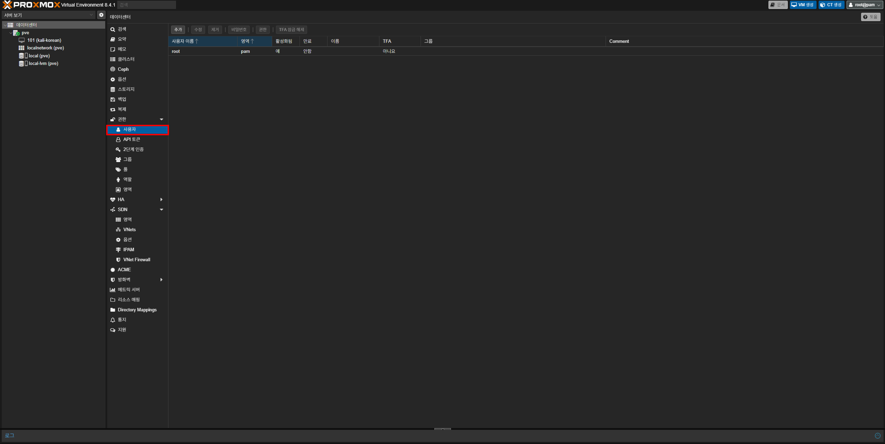
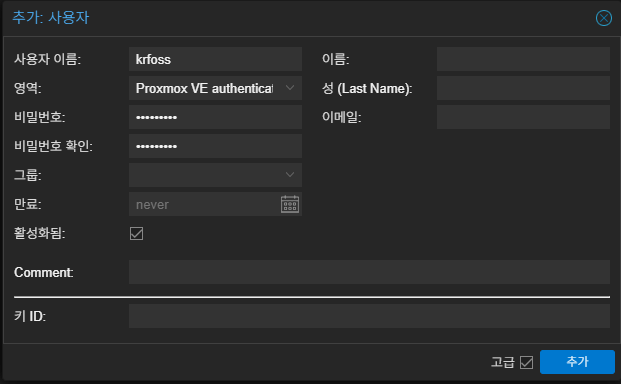
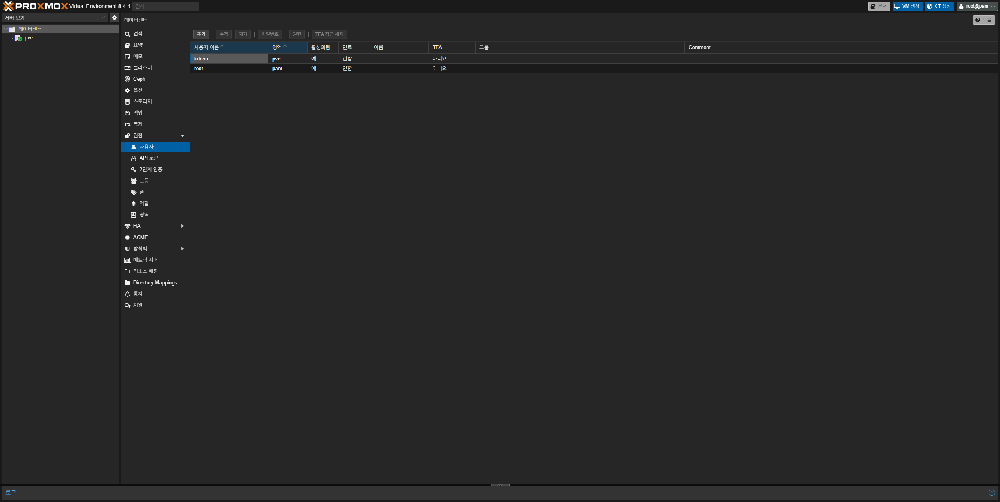
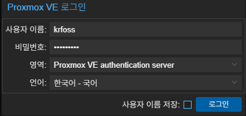
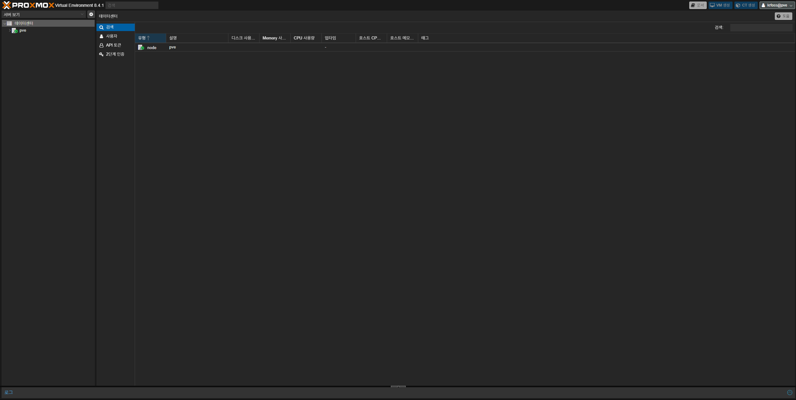

먼저 Proxmox 웹 인터페이스를 열고 `데이터센터 - 권한 - 사용자`로 이동한 뒤, **추가** 버튼을 클릭하세요.

버튼을 누르게 되면 사용자 생성 화면이 나타나게 되는데 `사용자 이름`을 입력하고, `영역`은 Proxmox VE autneitcation server로 선택 후 `비밀번호`를 입력하세요. 비밀번호는 8글자 이상만 가능해요. (이 가이드에서는 krfoss로 계정을 생성해요)

완료 되었다면 **추가** 버튼을 클릭하세요.

생성을 하게되면 다음과 같이 사용자가 하나 더 생겨요.

이제 정상적으로 접속이 되는지 확인할 차례에요. 우측 상단의 `root@pam`을 눌러 로그아웃 후 위에서 생성한 계정으로 로그인하세요. 영역이 **Proxmox VE authentication server**로 되어있는지 확인하는 걸 잊지마세요.

노드 이외에 아무것도 보이지 않는다면 정상적으로 생성된 거에요.

