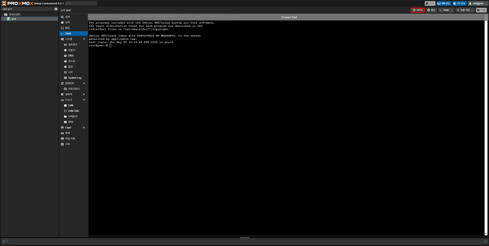

우선 Proxmox 웹 인터페이스에서 노드를 선택 후 좌측 메뉴의 **Shell**을 여세요.


그런 다음 `/etc/default/grub` 파일을 나노(nano)에디터나 vi 에디터로 여세요.

```bash
# nano 에디터의 경우:
nano /etc/default/grub

# vi(vim) 에디터의 경우:
vi /etc/default/grub
```

열게 되면 다음과 같은 내용이 보이게 돼요.

```plaintext
# If you change this file, run 'update-grub' afterwards to update
# /boot/grub/grub.cfg.
# For full documentation of the options in this file, see:
#   info -f grub -n 'Simple configuration'

GRUB_DEFAULT=0
GRUB_TIMEOUT=3
GRUB_DISTRIBUTOR=`lsb_release -i -s 2> /dev/null || echo Debian`
GRUB_CMDLINE_LINUX_DEFAULT="quiet"
GRUB_CMDLINE_LINUX=""

...
```

이제 여기서 `GRUB_CMDLINE_LINUX_DEFAULT` 항목을 수정할 거에요. 본인의 CPU(인텔 또는 AMD)에 따라 방법이 다르니 아래 내용을 참고하여 설정하세요.

{}
GRUB 파일에서 구분은 쉼표가 아닌 띄어쓰기를 사용하며 대소문자를 확실하게 구분하여야 해요.

AMD 서버 한정으로 패스스루 후 VM을 켰을 때 연결된 모든 장치가 멈추는 문제가 있다면 아래의 `문제 해결 가이드`를 참고하세요.
{}

```plaintext
# Intel:
GRUB_CMDLINE_LINUX_DEFAULT="quiet intel_iommu=on iommu=pt"

# AMD:
GRUB_CMDLINE_LINUX_DEFAULT="quiet amd_iommu=on iommu=pt"
```

변경이 완료되었으면, 다음 명령어를 입력하여 변경사항을 업데이트 해야해요.

```bash
update-grub
```

변경사항이 문제 없이 반영되었다면 Proxmox 웹 인터페이스 상단의 **재부팅** 버튼을 누르거나 쉘에서 **reboot을 입력**하여 재부팅하세요.



---

## 문제 해결 가이드: 패스스루 후 VM 시작 시 모든 장치가 멈추는 경우

{}
해당 문제는 모든 AMD 서버에서 나타나지 않아요. 정상적으로 켜진다면 넘어가면 돼요.
{}

일부 메인보드 및 칩셋에서 IOMMU 그룹이 하나로 묶여있어 패스스루가 시 연결된 모든 장치가 멈추는 문제에요. 아래 내용들을 따라서 적용하세요.

우선 다시 `/etc/default/grub` 파일을 여세요.

```bash
# nano 에디터의 경우:
nano /etc/default/grub

# vi(vim) 에디터의 경우:
vi /etc/default/grub
```

이전에 추가한 `GRUB_CMDLINE_LINUX_DEFAULT` 부분 마지막에 다음 내용을 추가하세요. (쉼표 대신 띄어쓰기로 구분해야 해요)

```plaintext
pcie_acs_override=downstream,multifunction
```

위 내용을 추가한 전체적인 내용은 이렇게 돼요:

```plaintext
GRUB_CMDLINE_LINUX_DEFAULT="quiet amd_iommu=on iommu=pt pcie_acs_override=downstream,multifunction"
```

이제 위와 동일한 방법으로 변경사항을 업데이트 후 재부팅하세요.

```bash
update-grub && reboot
```

재부팅이 완료되었다면, IOMMU 그룹이 더 작은 IOMMU 그룹으로 분리되어 문제 없이 패스스루를 할 수 있어요.