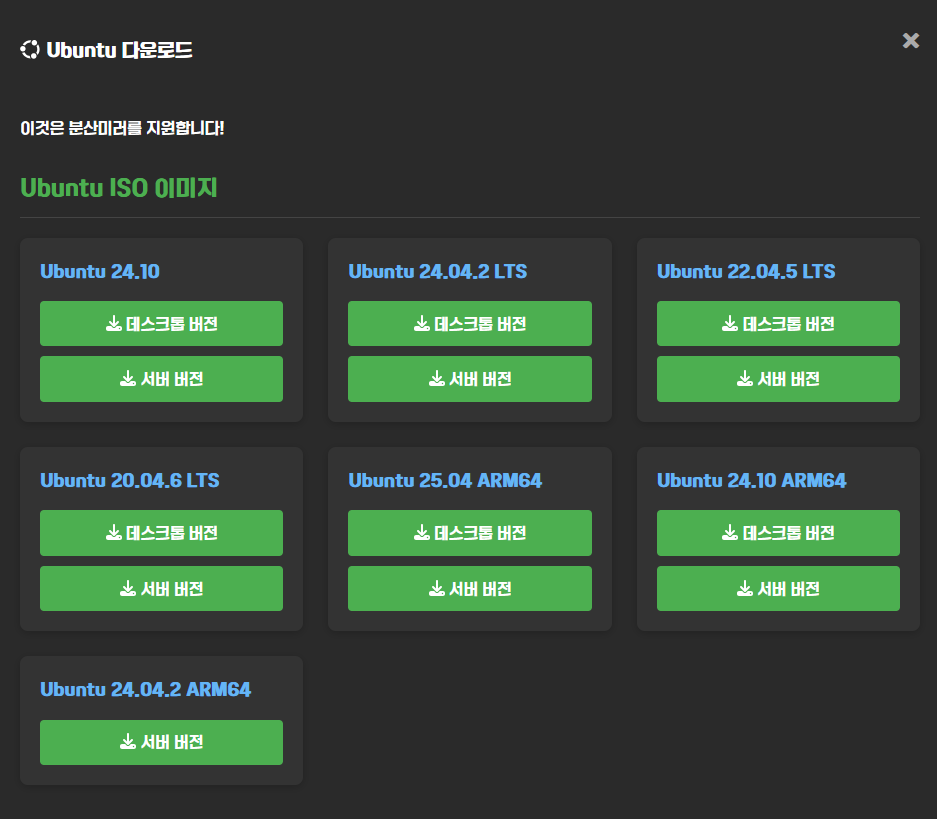

우분투는 전세계적으로 많은 사람들이 사용하는 유명한 운영체제이에요. 이 글에서는 아직 어디서 우분투를 다운로드 해야 하는지 잘 모르는 사람들을 위해 작성되었어요.

## 공식 사이트에서 다운로드

가장 최고의 방법은 캐노니컬에서 운영하는 [우분투 공식 사이트](https://ubuntu.com/download/desktop)에서 다운로드 하는 거에요. 다만 페이지가 한국어로는 제공되지 않으니 참고해주세요.

사이트 들어왔다면 가장 먼저 Ubuntu 24.04.2 LTS라고 보이는 게 있을 거에요. 

잘 보면 우측에 `Download` 버튼이 있어요. 이걸 눌러서 다운로드 할 수 있어요. 다만 다운로드 버튼 자체는 우분투 공식 사이트에서 눌렀지만, 실제 파일은 우분투 서버가 아닌 우분투에서 공식적으로 등록된 미러에서 다운로드 하기 때문에 해당 미러가 트래픽이 많이 몰린 상태이거나 업데이트 중이라면 다운로드 속도가 느릴 수 있단 점은 알아야 해요.

## ROKFOSS에서 다운로드

ROKFOSS 프로젝트에서도 다운로드 할 수 있어요. 프로젝트 참여 미러는 모든 파일을 우분투 공식 미러로부터 복제하고 있어요.

먼저 [ROKFOSS 프로젝트 공식](https://http.krfoss.org) 사이트에 접속한 뒤에 조금만 스크롤을 내리고 아래와 같은 것을 찾아주세요.

여기서 Ubuntu를 누르면 각종 버전의 우분투가 나오는데 여러분이 선호하는 버전으로 다운로드 해주세요. 이 글에서는 `24.04.2 LTS`를 받아볼께요. 

ROKFOSS 프로젝트에서는 사용자의 아이피를 기준으로 가장 가까운 미러들을 우선으로 링크를 생성하고 있어서 빠른 속도로 파일을 다운로드 받아볼 수 있어요. 예를 들어서 광주광역시에 있다면 `ZzuniMirror`가 가장 많이 뜨는 걸 볼 수 있을 거에요.

## 파일 다운로드 완료

파일 다운로드가 완료되었나요? 이제 우분투를 직접 물리서버에 설치하거나 가상서버에 설치할 수 있어요. 